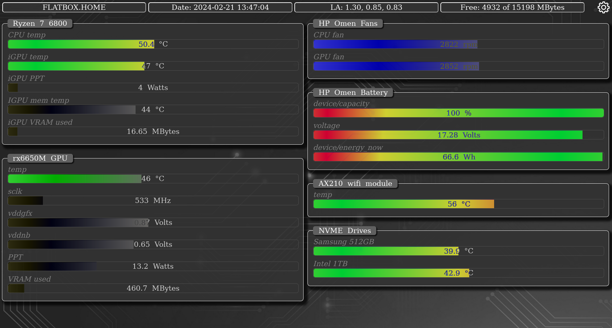
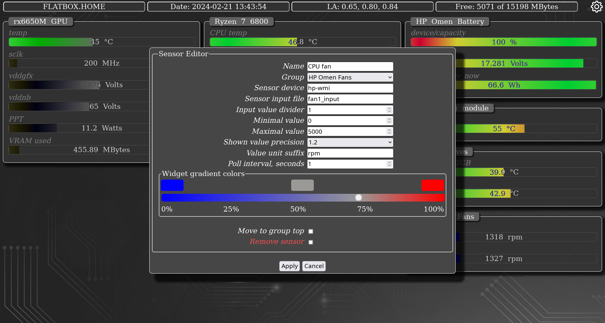
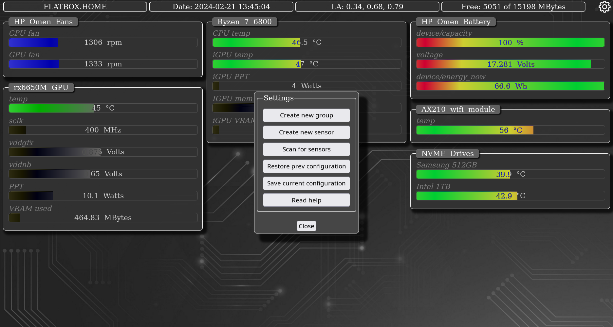

# nonsens
**N**ew **O**r **N**ot **SENS**ors monitor.

This is a simple browser based Linux sensors monitoring tool.

It runs as a server on a Linux box and is fully configurable via web page.

It is **not** based on **lm-sensors** or any other sensors software/library.

It reads sensors data directly from linux **/sys/class/hwmon** filesystem.

It is fast, lightweight and easily customisable.

It looks like this:

### Installation

    $ git clone https://github.com/maxb-odessa/nonsens.git
    $ cd nonsens
    $ make install
This will fetch, build and install **nonsens**. Now point your browser at `localhost:12346` and configure it.

### Configuration
Click a gear located at top-right corner. Scan for sensors. Save current configuration.

Initialization complete. Now you may edit/adjust freshly found sensors.

Click on group name to edit it.

Click on sensor widget to edit it.

Don't forget to Gear -> Save current configuration when you're done.

